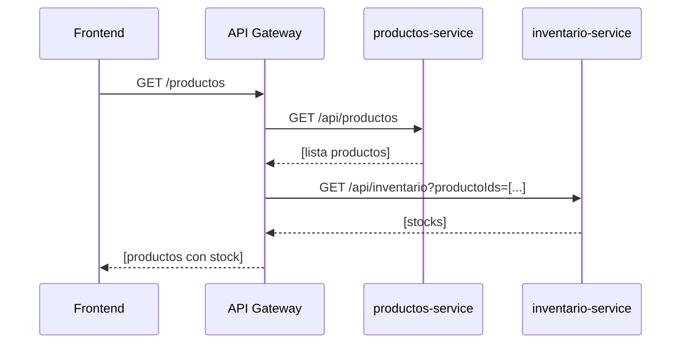
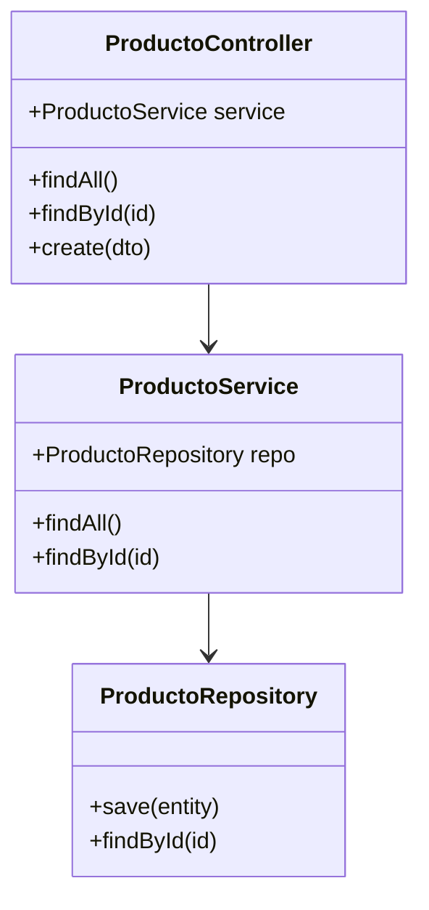
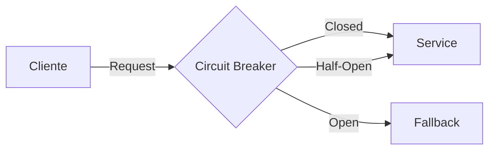
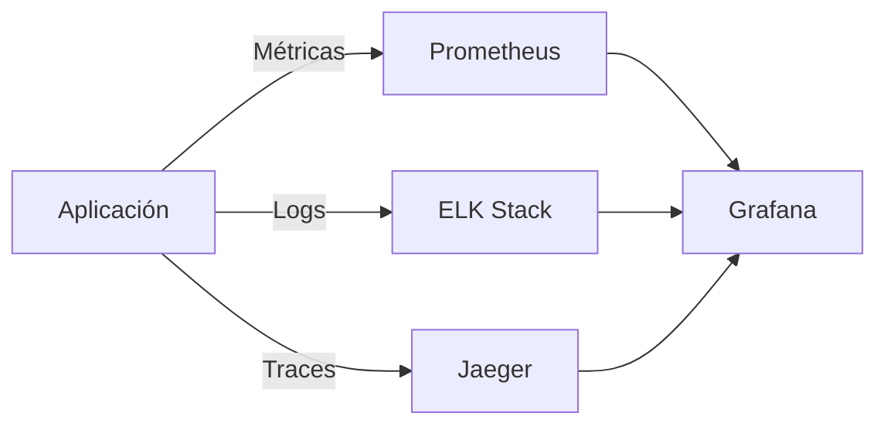
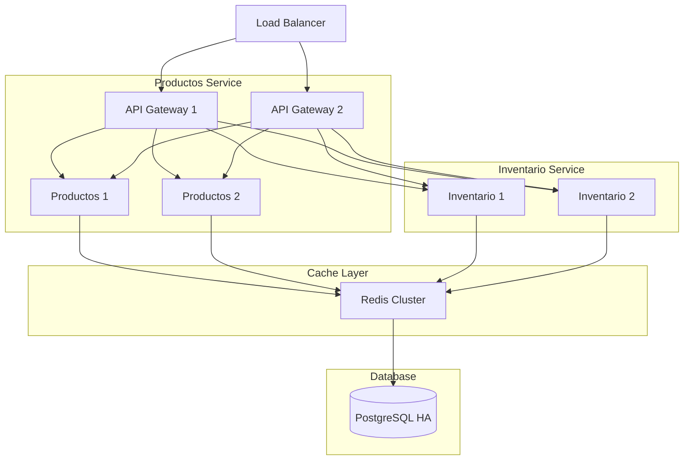

# Arquitectura y Diagramas Técnicos

## Arquitectura general del sistema

```mermaid
flowchart LR
  A[Frontend (Angular 19)] -->|HTTP| B[API Gateway / Reverse Proxy] 
  B --> C[productos-service]
  B --> D[inventario-service]
  C -->|JDBC/ORM| E[(Postgres)]
  D -->|JDBC/ORM| E
  C --> F[Cache (Redis)]
  D --> F
  subgraph CI/CD
    G[GitHub Actions] --> H[Registry/Deploy]
  end
```

## Flujo de datos - Consulta de inventario



## Patrones de diseño implementados

### Patrón Repository


### Circuit Breaker Pattern


## Componentes principales

### Microservicios
1. productos-service:
   - Gestión de productos
   - CRUD operaciones
   - Cache de productos frecuentes

2. inventario-service:
   - Control de stock
   - Reserva de inventario
   - Notificaciones de bajo stock

### Frontend Angular
- Módulos lazy-loaded
- State management (servicios)
- Componentes reutilizables
- Interceptores HTTP

## Herramientas de desarrollo recomendadas

### Diagramación
- **Mermaid**: Diagramas en Markdown (usado aquí)
- **PlantUML**: Diagramas más detallados
- **draw.io**: Diagramas visuales
- **Structurizr**: Diagramas C4

### Monitoreo y observabilidad


## Escalabilidad y alta disponibilidad

### Arquitectura propuesta para producción


## Notas técnicas adicionales

### Seguridad
- Autenticación: OAuth2/JWT
- TLS en todas las conexiones
- Rate limiting en API Gateway
- Secrets en HashiCorp Vault

### CI/CD
- GitHub Actions para CI
- Docker Registry para imágenes
- Deploy automatizado a staging
- Pruebas de integración